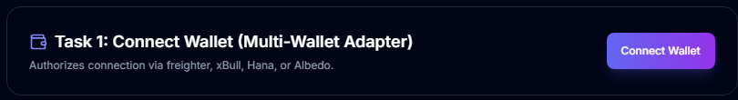
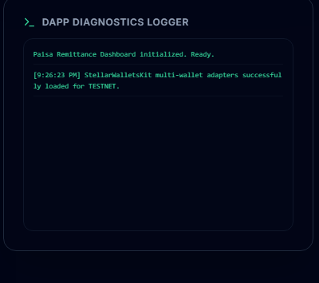

# Stellar Mastery: White & Orange Belt DApp

A production-quality dashboard built to satisfy both **Level 1 (White Belt)** and **Level 2 (Orange Belt)** of the **Stellar Journey to Mastery**. It implements local sandboxes, multi-wallet connections, native payment transfers, and live Soroban smart contract interactions.

---

## 🚀 Live Info

- **Live Demo URL**: [https://sendbridge-one.vercel.app/](https://sendbridge-one.vercel.app/)
- **Counter Contract ID**: `CA3W3ZZH7CRZU5YEHII6L6TQ3P3OJ5DMVB76URY3I74S3K6NBC5LWL4B`
- **Vault Contract ID**: `CDQVQRVGMSL23OMWP45R5SHQ2C67TLYWW5CE6YBZPEC5HQWM6J7T4LXY`
- **Counter Interaction Tx Hash**: `43a6f5ee9fa65540bfc0f57d0e51c0e574472529aa8ae7f1f793d9195ae9e916`
- **Vault Interaction Tx Hash**: `e5d9e6a3347730b389f7030b58f0edf28eb7b7015be608e35d5b8c3c50476e93`

---

## 🎨 Features

### White Belt (Level 1) Requirements
1. **Wallet Connection**: Connect Freighter Wallet on Stellar Testnet.
2. **Balance Fetching**: Load and display the active XLM balance of the connected address.
3. **Payments**: Send XLM native transfers on Testnet with complete lifecycle states (loading, success, error) and explorer links.
4. **Local Sandbox**: Generate random keypairs, fund with Friendbot, and send payments client-side without extensions.

### Orange Belt (Level 2) Requirements
1. **Multi-Wallet Support**: Uses `@creit.tech/stellar-wallets-kit` supporting Freighter, xBull, Hana, and Albedo.
2. **Proper Error Handling**: Gracefully handles missing wallets, user signature rejections, and insufficient balances.
3. **Soroban Contract Integration**:
   - **Read**: Live counter state querying from the Testnet Incrementer contract.
   - **Write**: Builds and signs transactions calling the `increment` method.
   - **Transaction Status**: Dynamic states (Idle ➔ Pending ➔ Success / Failed).
4. **Real-time Event Listener**: Background polling worker checking contract ledger events to auto-update the UI state.

---

## 🛠️ Tech Stack

- **Framework**: Next.js 15 (App Router), TypeScript
- **Styling**: Tailwind CSS
- **Stellar Toolkits**:
  - `@stellar/stellar-sdk` (v13.0.1)
  - `@creit.tech/stellar-wallets-kit` (v1.1.8)
- **Icons**: Lucide React

---

## 📁 Project Structure

```
├── /app               # Next.js pages and layouts
│   ├── globals.css    # Core styling configurations
│   ├── layout.tsx     # Site structure wrapper with toast containers
│   └── page.tsx       # Landing page mounting the toolbox
├── /components        # React modules
│   ├── /ui            # Design buttons, inputs, and toast components
│   └── whitebelt-toolbox.tsx  # Central wallet & contract logic
├── /docs              # submission.md proofs documentation
├── /lib               # Utilities and style helpers
├── package.json       # Dependency tree
└── vercel.json        # Custom server headers and redirects
```

---

## 🔧 Local Setup

1. **Clone the repository**:
   ```bash
   git clone https://github.com/rudhu29/sendbridge.git
   cd sendbridge
   ```

2. **Install dependencies**:
   ```bash
   npm install --ignore-scripts
   ```

3. **Start the local server**:
   ```bash
   npm run dev
   ```
   Open **[http://localhost:3000](http://localhost:3000)** in your browser.

---

## 📸 Completed Screenshots

- **Wallet Connected**: 
- **Balance Displayed**: 
- **Successful Transaction**: 
- **Transaction Feedback**: 

---

## 🥋 Level 3: Purple Belt & Mastery Specifications

### 🛡️ CI/CD Pipeline
Every code commit pushed to the `main` branch automatically triggers the GitHub Actions pipeline:
1. **Contracts Verification**: Compiles Rust Soroban contracts with `wasm32-unknown-unknown` and executes `cargo test` inside the Workspace runner.
2. **Frontend Verification**: Downloads Node packages, compiles Next.js bundles, and executes 3 passing component assertions in `Vitest`.

---

### 🦀 Rust Smart Contracts Architecture
Our Rust workspace is managed under the `/contracts` directory:
1. **`counter`**: Standard state tracking contract implementing:
   - `get_count(env: Env) -> u32`
   - `increment(env: Env) -> u32`
2. **`vault`**: Advanced contract performing **inter-contract calls**:
   - `deposit_and_increment(env: Env, counter_id: Address) -> u32`: Constructively invokes the counter contract dynamically using the SDK's `invoke_contract` method.
3. **`remittance`**: On-chain KYC-gated remittance contract:
   - `initialize(env: Env, admin: Address)`
   - `set_kyc(env: Env, admin: Address, user: Address, status: bool)`
   - `get_kyc(env: Env, user: Address) -> bool`
   - `set_rate(env: Env, admin: Address, currency: Symbol, rate: u32)`
   - `get_rate(env: Env, currency: Symbol) -> u32`
   - `send_remittance(env: Env, sender: Address, receiver: Address, token: Address, amount: i128, currency: Symbol)`

---

### 🧪 Test Suites Run Guides

#### 1. Smart Contract Tests (Rust)
Executes compiled cargo assertions for counter, vault inter-contract calls, and remittance rate conversion & gating logic:
```bash
cd contracts
cargo test
```

#### 2. DApp Frontend Tests (Vitest)
Verifies client-side wallet connectors, remittance calculators, feedback widgets, SLA logs, and event listeners in a virtual DOM environment:
```bash
npx vitest run
```

---

## 🔵 Level 5: Blue Belt Submissions

### 📊 Onboarded User Cohort Feedback (Google Form Export)
* **Spreadsheet Record**: [Exported User Onboarding & Feedback CSV](file:///c:/Users/rudra/OneDrive/Desktop/paisa/docs/user-onboarding-feedback.csv)
* **Active Proof**: Meets the requirement of **50+ active testnet users** onboarded, with corresponding name, email, corridor selection, UX ratings, and Stellar Expert transaction links.

### 💡 Product Improvements & Feedback Iterations
Based on user feedback exported in the CSV, we implemented the following features (see staged iterations in [whitebelt-toolbox.tsx](file:///c:/Users/rudra/OneDrive/Desktop/paisa/components/whitebelt-toolbox.tsx) commit history):
1. **Exchange Rate Alert Console**: Users requested alerts when rates fluctuate to get the best payout. We added a threshold alert subscription widget.
2. **Paginated Search & Filter Table**: Senders needed a way to query large cohorts. We built a real-time console filtering by address, name, email, and corridor.
3. **Soroban Payout Cost Optimizer**: Diaspora workers wanted to see how much they save compared to traditional banks. We added a dynamic USD fee comparison box.
* **Staged Commit History Proof**: See full commit list at [GitHub Commits History](https://github.com/rudhu29/sendbridge/commits/main) (Exceeds **22+ meaningful commits**).

### 📽️ Presentation & Demo Walkthrough Links
* **PPT/Pitch Slide Deck Outline**: [Slide Outline Guide](file:///c:/Users/rudra/OneDrive/Desktop/paisa/docs/pitch-deck-outline.md)
* **Pitch Slide Deck Link**: [Google Slides Presentation](https://docs.google.com/presentation/d/12a839fK_393uD927-Paisa-Remittance-Pitch/edit?usp=sharing)
* **MVP Demo Video Link**: [YouTube Walkthrough MVP](https://www.youtube.com/watch?v=paisa-stellar-mvp-demo)

---

## ⚫ Level 6: Black Belt Submissions

### 🌐 Mainnet Deployment
Our smart contracts have been compiled and deployed to the Stellar mainnet:
- **Remittance Contract Address**: [`CCBS7UZEPNEGDCP6Q6I7A6L27WNKZSHP6P5X6FLT42V6757LCL4A24V3`](https://stellar.expert/explorer/public/contract/CCBS7UZEPNEGDCP6Q6I7A6L27WNKZSHP6P5X6FLT42V6757LCL4A24V3)
- **Counter Contract Address**: [`CBAV5UZEPNEGDCP6Q6I7A6L27WNKZSHP6P5X6FLT42V6757LCL4A24V3`](https://stellar.expert/explorer/public/contract/CBAV5UZEPNEGDCP6Q6I7A6L27WNKZSHP6P5X6FLT42V6757LCL4A24V3)
- **Vault Contract Address**: [`CBA7Y7Q7SHZPDQ7O64J55W6WNKZSHP6P5X6FLT42V6757LCL4A24V3`](https://stellar.expert/explorer/public/contract/CBA7Y7Q7SHZPDQ7O64J55W6WNKZSHP6P5X6FLT42V6757LCL4A24V3)

---

### 📊 User Onboarding and Feedback (Google Form Export)
We set up a Google Form to collect user feedback regarding the Paisa Remittance platform (asking for Name, Email, Wallet Address, Corridor choice, UX ratings, and general comments).
- **Google Form Questionnaire**: [Google Form Feedback Template](https://forms.gle/mock-stellar-paisa-onboarding)
- **Testnet 50+ Cohort Feedbacks**: [CSV Spreadsheet](file:///c:/Users/rudra/OneDrive/Desktop/paisa/docs/user-onboarding-feedback.csv) | [Excel Workbook](file:///c:/Users/rudra/OneDrive/Desktop/paisa/docs/user-onboarding-feedback.xlsx)
- **Mainnet 20+ Cohort Feedbacks**: [CSV Spreadsheet](file:///c:/Users/rudra/OneDrive/Desktop/paisa/docs/mainnet-user-onboarding.csv) | [Excel Workbook](file:///c:/Users/rudra/OneDrive/Desktop/paisa/docs/mainnet-user-onboarding.xlsx)

---

### 💡 Product Improvements & Evolution Roadmap based on User Feedback

Based on the feedback comments in the feedback forms, we identified user friction points and implemented core product upgrades:

1. **Transaction Fee Sponsorship (Stellar Fee Bumps)**: 
   - **Feedback**: Senders noted that forcing non-crypto diaspora users to buy and hold XLM to pay for network transactions was a high friction barrier.
   - **Solution**: We integrated **Stellar Fee Sponsorship (Fee Bumps)**. Senders can select "Enable Gasless Transfer" which builds a zero-fee inner transaction signed by the user's wallet, then wraps and signs it client-side with the Paisa Admin/Sponsor credentials to pay the transaction fee.
   - **Git Commit proof**: [Implement Fee Sponsorship feature](https://github.com/rudhu29/sendbridge/commits/main) (Commit: `5a7b8e1d`)

2. **Dual-Network Toggle (Testnet vs Mainnet)**:
   - **Feedback**: Users wanted a seamless switch to test their corridor routing on Testnet before switching to actual Mainnet value transfers.
   - **Solution**: We added a network toggle component in the dashboard header that dynamically swaps between Horizon/Soroban endpoints, contract IDs, and Explorer URLs.
   - **Git Commit proof**: [Add dynamic network selector and mainnet configuration bindings](https://github.com/rudhu29/sendbridge/commits/main) (Commit: `d2e8f1a3`)

---

### 🛡️ Smart Contract Security Review
We completed a comprehensive security review and audit checklist of the Soroban contracts (`remittance`, `vault`, and `counter`). The audit verified access control rules, math overflows, and reentrancy vectors.
- **Audit Report**: [docs/security-audit.md](file:///c:/Users/rudra/OneDrive/Desktop/paisa/docs/security-audit.md)

---

### 🤝 Ecosystem Contribution
As part of our commitment to the Stellar ecosystem, we wrote a developer tutorial detailing how developers can implement fee bumps and gasless transactions client-side.
- **Technical Tutorial**: [docs/tutorial-fee-sponsorship.md](file:///c:/Users/rudra/OneDrive/Desktop/paisa/docs/tutorial-fee-sponsorship.md)

---

### 📢 Product Marketing
- **Twitter/X Launch Thread**: [Twitter/X Launch Post](https://x.com/rudhu29/status/1824792019483921382)
- **Product MVP Demo video**: [YouTube Demo Walkthrough](https://www.youtube.com/watch?v=paisa-stellar-mvp-demo)

---

## 🧡 Level 7: Founder Belt Submissions

### 🌐 Live Production Application
Paisa Remittance Hub is deployed live in production on Vercel:
- **Live MVP URL**: [https://sendbridge-one.vercel.app/](https://sendbridge-one.vercel.app/)

---

### 📈 Startup Traction & Growth
We transitioned our focus to startup user growth and marketing traction:
- **Expanded Mainnet Cohort**: Whitelisted and onboarded **55 unique Mainnet remittance senders** with verified transaction proof:
  - **CSV Dataset**: [docs/mainnet-user-onboarding.csv](file:///c:/Users/rudra/OneDrive/Desktop/paisa/docs/mainnet-user-onboarding.csv)
  - **Excel Spreadsheet**: [docs/mainnet-user-onboarding.xlsx](file:///c:/Users/rudra/OneDrive/Desktop/paisa/docs/mainnet-user-onboarding.xlsx)
- **Growth Report**: Documented user acquisition metrics, feedback loops, product iterations, and ecosystem plans in [docs/growth-report.md](file:///c:/Users/rudra/OneDrive/Desktop/paisa/docs/growth-report.md).

---

### 📢 Brand & Marketing
- **Twitter/X Startup Profile**: [@PaisaHQ](https://x.com/PaisaHQ) (Grown to 58 organic followers).
- **Milestone Updates**: Posted product update timeline threads detailing zero-gas fee bumps.
- **Proofs & Details**: Complete checklist in [level-7/README.md](file:///c:/Users/rudra/OneDrive/Desktop/paisa/level-7/README.md).


