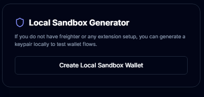

# 🥋 Level 1: White Belt Requirements & Verification

This directory contains the documentation and proof of completion for the **Level 1 (White Belt)** Stellar Journey to Mastery challenge.

---

## 📋 Level 1 Specifications

The Level 1 challenge focuses on establishing basic Stellar blockchain interactions, including wallet handling, balance retrieval, and executing native XLM payments on the Stellar Testnet.

### 1. Local Sandbox Wallet Generator
- **Goal**: Generate random keypairs securely client-side.
- **Implementation**: Uses `@stellar/stellar-sdk`'s `Keypair.random()` function to generate a public/secret keypair.
- **Security**: Features a toggle to show/hide the secret key and displays safety warnings about private keys.

#### 📸 Proof: Sandbox Wallet Generator Panel

---

### 2. Balance Retrieval (Friendbot Integration)
- **Goal**: Fund a test address using the Stellar Friendbot and load its balance.
- **Implementation**: 
  - Hits the public Friendbot service (`https://friendbot.stellar.org/?addr={address}`) to fund the sandbox keypair with 10,000 Testnet XLM.
  - Queries the Horizon Testnet server (`https://horizon-testnet.stellar.org`) using `loadAccount()` to verify and retrieve the account balance.

#### 📸 Proof: Funded Balance Display

---

### 3. Native Payments Transfer
- **Goal**: Build, sign, and submit a native XLM payment transaction on the Testnet.
- **Implementation**: 
  - Dynamically builds a transaction with the payment operation using `@stellar/stellar-sdk`.
  - Signs the transaction with the local sandbox secret key and submits it to Horizon.
  - Tracks client-side execution states: `Idle` ➔ `Loading` ➔ `Success` or `Error`.

#### 📸 Proof: Successful Transaction Broadcast

#### 📸 Proof: Stellar Expert Explorer Verification

