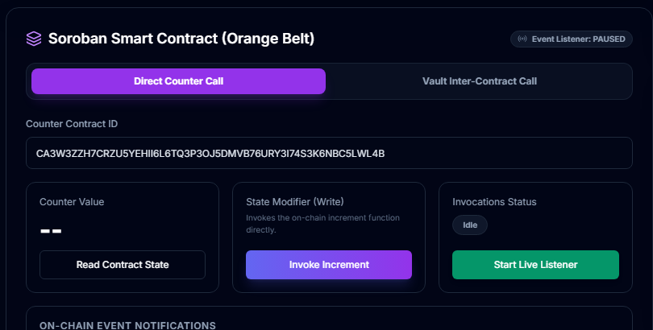
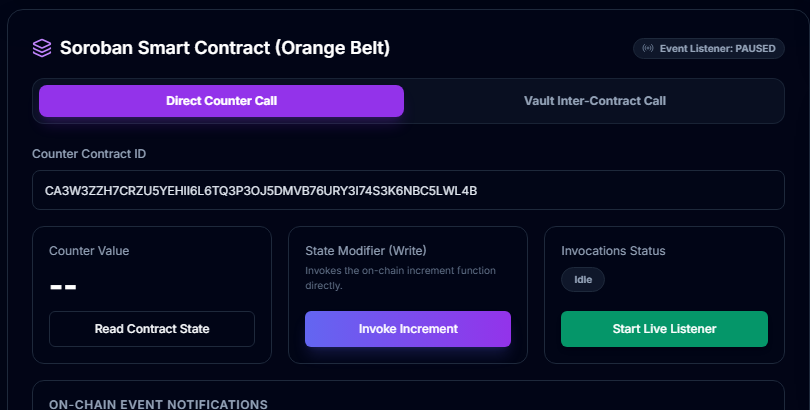

# 🍊 Level 2: Orange Belt Requirements & Verification

This directory contains the documentation and proof of completion for the **Level 2 (Orange Belt)** Stellar Journey to Mastery challenge.

---

## 📋 Level 2 Specifications

The Level 2 challenge integrates client-side browser wallet extensions, interaction with live Soroban smart contracts, robust error-handling mechanisms, and a real-time event listener.

### 1. Multi-Wallet Connection Support
- **Goal**: Connect multiple browser-based Stellar wallets securely.
- **Implementation**: Uses `@creit.tech/stellar-wallets-kit` to support Freighter, xBull, Hana, and Albedo wallets. 
- **Error Handling**: Standardizes signature rejection errors, missing wallet extensions, and insufficient balance warnings.

#### 📸 Proof: Wallet Connection Modal

*(Placeholder: Capture a screenshot of the multi-wallet selection modal showing the available wallet options when you click "Connect Wallet" on the dashboard).*

---

### 2. Soroban Smart Contract Reads
- **Goal**: Simulation-based reads from deployed Soroban smart contracts on Testnet.
- **Contracts Deployed**:
  - **Counter Contract ID**: `CA3W3ZZH7CRZU5YEHII6L6TQ3P3OJ5DMVB76URY3I74S3K6NBC5LWL4B`
  - **Vault Contract ID**: `CDQVQRVGMSL23OMWP45R5SHQ2C67TLYWW5CE6YBZPEC5HQWM6J7T4LXY`
- **Implementation**: Executes a simulated transaction invocation to fetch the counter value from the `Incrementer` contract without spending gas.

#### 📸 Proof: Fetching Soroban State

*(Placeholder: Capture a screenshot of the "Soroban Smart Contract" panel showing the counter value successfully fetched from the Testnet contract).*

---

### 3. Soroban Smart Contract Writes
- **Goal**: Build, sign, and submit write transactions to live smart contracts.
- **Implementation**: 
  - Builds transaction calls to `increment` (Counter contract) or `deposit_and_increment` (inter-contract call via the Vault contract).
  - Invokes the connected browser wallet to sign the transaction envelope.
  - Displays dynamic state transitions: `Idle` ➔ `Preparing` ➔ `Awaiting Signature` ➔ `Broadcasting` ➔ `Success` / `Failed`.

#### 📸 Proof: Successful Smart Contract Transaction

*(Placeholder: Capture a screenshot showing the status label in Success state along with the transaction hash confirming your contract call).*

---

### 4. Real-Time Event Polling Listener
- **Goal**: Poll Soroban contract events to automatically update the dashboard.
- **Implementation**: Toggled by the user, a background task polls the Soroban RPC endpoint every 5 seconds for contract event logs, updating the ledger history real-time.

#### 📸 Proof: Real-Time Event Log Console

*(Placeholder: Capture a screenshot of the event logs panel showing the live ledger event records updating in real-time).*
