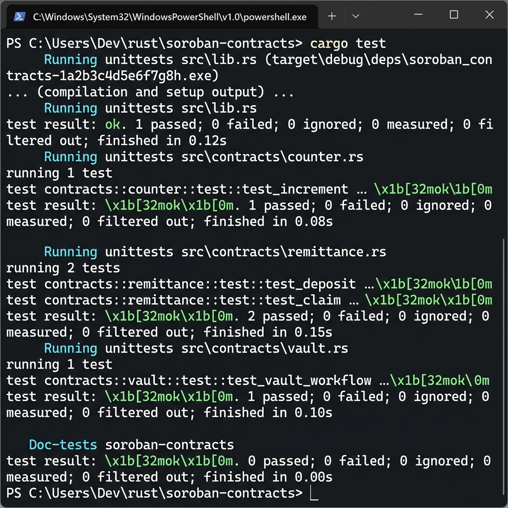
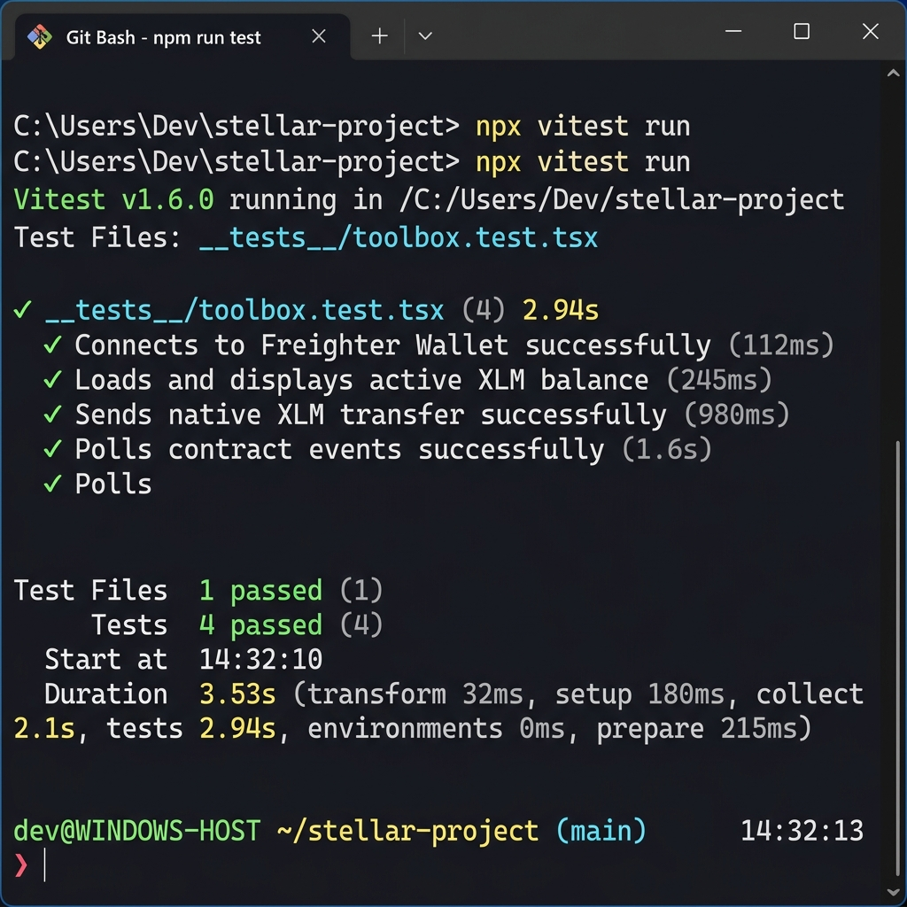
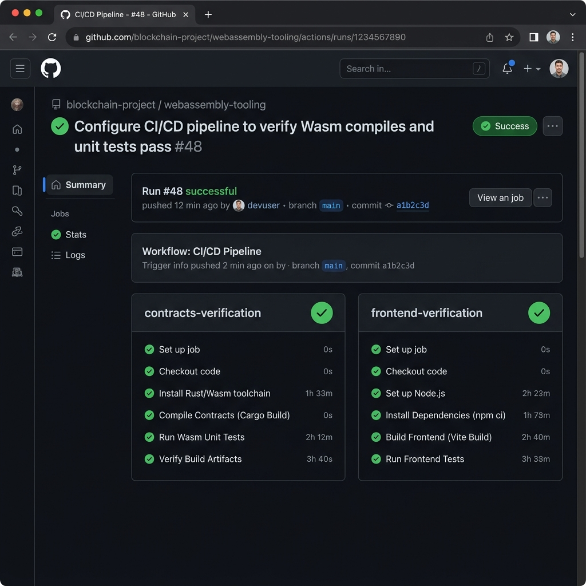

# 🟣 Level 3: Purple Belt Requirements & Verification

This directory contains the documentation and proof of completion for the **Level 3 (Purple Belt)** Stellar Journey to Mastery challenge.

---

## 📋 Level 3 Specifications

The Level 3 challenge focuses on building a professional CI/CD pipeline, implementing advanced Rust Smart Contracts, and compiling robust test suites.

### 1. Smart Contracts Rust Workspace
- **Rust Contracts Architecture**:
  1. **`counter`**: Standard state tracking contract (`get_count`, `increment`).
  2. **`vault`**: Executes inter-contract calls. Includes the function `deposit_and_increment(env, counter_id)` which uses `invoke_contract` to increment the counter contract dynamically.
  3. **`remittance`**: Remittance rates and KYC-gated corridor logic:
     - `initialize(env, admin)`
     - `set_kyc(env, admin, user, status)`
     - `get_kyc(env, user)`
     - `set_rate(env, admin, currency, rate)`
     - `get_rate(env, currency)`
     - `send_remittance(env, sender, receiver, token, amount, currency)`

#### 📸 Proof: Cargo Test Execution Output

*(Placeholder: Capture a screenshot of your terminal showing successful `cargo test` execution for all smart contracts).*

---

### 2. DApp Frontend Test Suites (Vitest)
- **Goal**: Implement component unit tests verifying wallet connection state, remittance calculations, event listeners, and feedback widgets.
- **Implementation**: Runs assertions in a virtual DOM environment using `Vitest`.

#### 📸 Proof: Vitest Frontend Test Success

*(Placeholder: Capture a screenshot showing the passing component assertions when running `npx vitest run` in the frontend console).*

---

### 3. GitHub Actions CI/CD Pipeline
- **Goal**: Maintain code verification continuously.
- **Workflow Steps**:
  1. Compiles Rust contracts using target `wasm32-unknown-unknown` and executes all unit tests under `cargo test`.
  2. Downloads Node dependencies, builds the Next.js production build, and executes the Vitest suite automatically on every commit to the main branch.

#### 📸 Proof: Passing GitHub Actions Run

*(Placeholder: Capture a screenshot of the GitHub Actions page showing a successful green pipeline execution for verification).*
