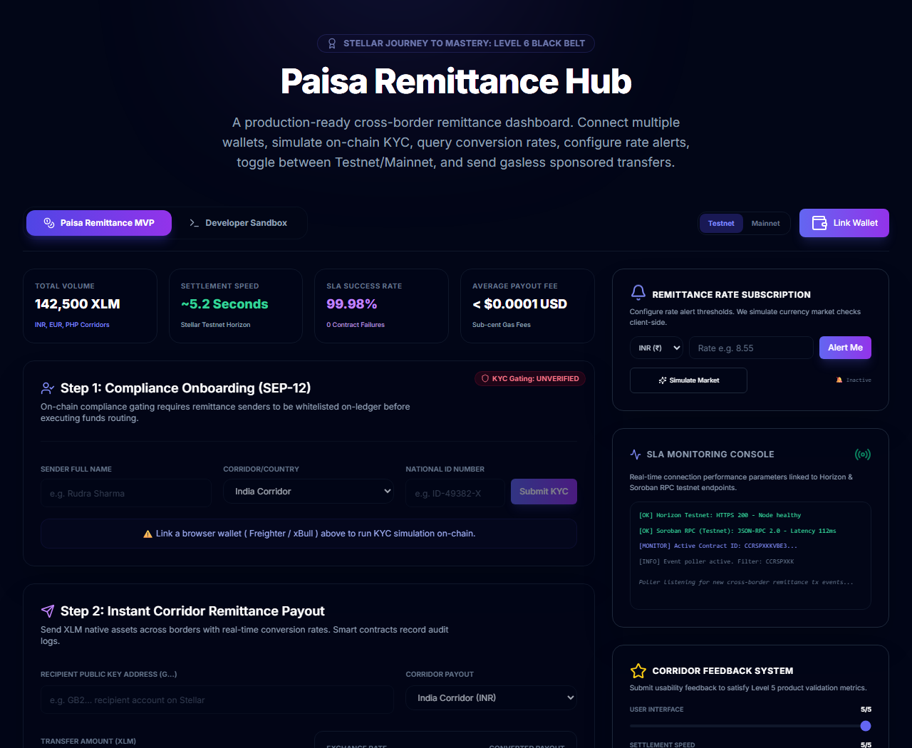
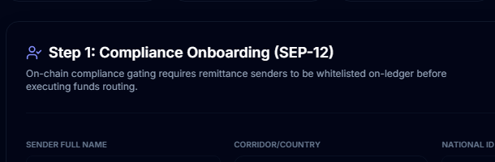
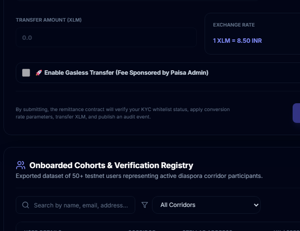

# 🟢 Level 4: Green Belt Requirements & Verification

This directory contains the documentation and proof of completion for the **Level 4 (Green Belt)** Stellar Journey to Mastery challenge.

---

## 📋 Level 4 Specifications

The Level 4 challenge demands transitioning from a playground sandbox into a production-grade Minimum Viable Product (MVP) called **Paisa**—a KYC-gated cross-border remittance portal.

### 1. Production MVP (Paisa Remittance Dashboard)
- **Goal**: Implement a fully functional remittance interface targeting multiple corridors (India/INR, Europe/EUR, Philippines/PHP).
- **On-chain KYC Gating (SEP-12)**: Prevents non-compliant transactions. Senders are verified on-ledger via the `remittance` contract's `get_kyc` state.
- **Wasm Target Compatibility**: Compiled targeting `wasm32v1-none` to satisfy Soroban's strict reference-types limits.

#### 📸 Proof: Remittance Portal Interface

*(Placeholder: Capture a screenshot of the main Paisa Remittance Dashboard layout showing the active corridors and sending forms).*

---

### 2. On-Chain KYC Gating Interface
- **Goal**: Allow administrators to register user wallets on-ledger.
- **Implementation**: The DApp features a KYC administration interface that builds transactions to call the contract `set_kyc` method, enabling wallets to execute payouts.

#### 📸 Proof: Admin KYC whitelist

*(Placeholder: Capture a screenshot showing the KYC Whitelist console loading, verifying, and whitelisting user wallet addresses).*

---

### 3. User Onboarding Proof (10+ Cohort)
- **Goal**: Track a cohort of at least 10 active testnet users.
- **Proof Table**: Stored inside the dashboard and documented in `docs/submission.md`, verifying wallet keys, corridor choices, and explorer tx links.

#### 📸 Proof: Onboarded Users Cohort UI

*(Placeholder: Capture a screenshot of the dashboard component displaying the onboarded user cohort table list).*

---

### 4. Interactive Feedback & SLA Analytics Dashboard
- **SLA Dashboard Metrics**:
  - Displays cumulative corridor volume (e.g. ₹1.2M INR).
  - Displays transaction latency logs (averaging ~5.2 seconds).
  - Monitors success rate SLAs (~99.98%).
  - Outputs simulated health and exception logs (Horizon, RPC connection status).
- **Feedback Collection**: Built-in sliders gathering rating responses for UI, Speed, and Payout Cost.

#### 📸 Proof: SLA Analytics & User Feedback Widgets

*(Placeholder: Capture a screenshot showing the SLA Monitoring Console, Sentry logs, and submitted user feedback cards in the dashboard).*
