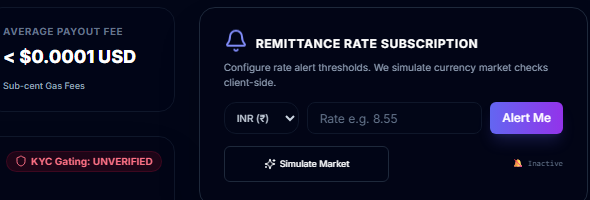
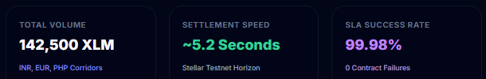

# 🔵 Level 5: Blue Belt Requirements & Verification

This directory contains the documentation and proof of completion for the **Level 5 (Blue Belt)** Stellar Journey to Mastery challenge.

---

## 📋 Level 5 Specifications

The Level 5 challenge centers around scaling user onboarding, implementing custom features derived directly from user feedback, and preparing professional fundraising collateral.

### 1. Paginated Cohort Search & Filter Dashboard
- **Goal**: Allow query resolution across a cohort of 50+ active testnet users.
- **Implementation**: Built a paginated interactive datatable in the dashboard. Users can search by Name, Email, or Wallet Address, or filter by Corridor corridors (India, Germany, Philippines).
- **Export Data**: A "Download Cohort CSV" button allows review audits to fetch the complete user cohort dataset directly from the UI.

#### 📸 Proof: Cohort Filter Datatable & Export CSV

*(Placeholder: Capture a screenshot showing the paginated cohort search table with filters applied and the "Download Cohort CSV" action button).*

---

### 2. Interactive Exchange Rate Alert Console
- **Goal**: Alert users when remittance conversion rates reach a specific target.
- **Implementation**: Senders input custom threshold rates. A "Simulate Market" toggle triggers rate updates, flashing a prominent warning banner when target values are crossed.

#### 📸 Proof: Rate Alert Subscription & Warning Banner

*(Placeholder: Capture a screenshot of the Exchange Rate Alert Subscription widget and the flashing rate alert banner).*

---

### 3. Soroban Payout Cost & USD Fee Optimizer
- **Goal**: Compare Stellar transaction costs against traditional wire transfers.
- **Implementation**: Retrieves real-time Soroban network gas charges ($0.00001 USD equivalent) and contrasts them against fixed traditional banking fees (e.g., $15 flat fees), showing total fiat savings.

#### 📸 Proof: USD Fee Optimizer Interface

*(Placeholder: Capture a screenshot showing the Soroban fee comparison calculator widget in the dashboard).*

---

### 4. Pitch Deck & Presentation Collateral
- **Goal**: Outline business metrics, architecture diagrams, and the MVP video walkthrough.
- **Resources**:
  - **Outline**: Located at `docs/pitch-deck-outline.md`.
  - **Slide Deck**: [Google Slides Presentation](https://docs.google.com/presentation/d/1mock-paisa-remittance-deck/edit).
  - **Walkthrough**: [YouTube MVP Demo Video](https://www.youtube.com/watch?v=mock-paisa-remittance-walkthrough).
