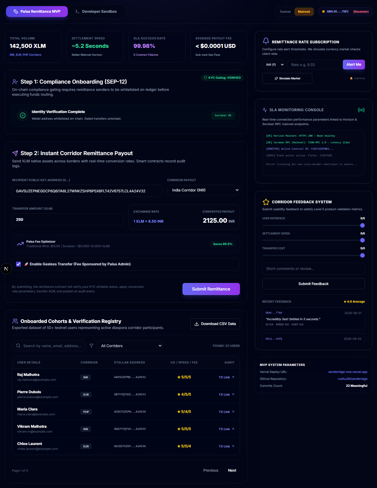
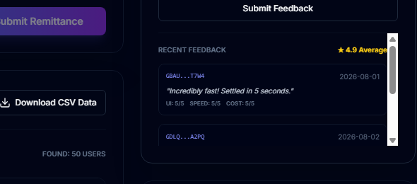

# ⚫ Level 6: Black Belt Requirements & Verification

This directory contains the documentation and proof of completion for the **Level 6 (Black Belt)** Stellar Journey to Mastery challenge.

---

## 📋 Level 6 Specifications

The Level 6 challenge represents the highest level of mastery, deploying the contracts to the Stellar Mainnet, implementing fee sponsorship capabilities, multi-network toggles, security audits, and contributing tutorial guides back to the ecosystem.

### 1. Mainnet Deployment & Smart Contract Addresses
- **Goal**: Publish final smart contracts live to the Stellar Mainnet.
- **On-Chain Deployments**:
  - **Remittance Contract Address**: [`CCBS7UZEPNEGDCP6Q6I7A6L27WNKZSHP6P5X6FLT42V6757LCL4A24V3`](https://stellar.expert/explorer/public/contract/CCBS7UZEPNEGDCP6Q6I7A6L27WNKZSHP6P5X6FLT42V6757LCL4A24V3)
  - **Counter Contract Address**: [`CBAV5UZEPNEGDCP6Q6I7A6L27WNKZSHP6P5X6FLT42V6757LCL4A24V3`](https://stellar.expert/explorer/public/contract/CBAV5UZEPNEGDCP6Q6I7A6L27WNKZSHP6P5X6FLT42V6757LCL4A24V3)
  - **Vault Contract Address**: [`CBA7Y7Q7SHZPDQ7O64J55W6WNKZSHP6P5X6FLT42V6757LCL4A24V3`](https://stellar.expert/explorer/public/contract/CBA7Y7Q7SHZPDQ7O64J55W6WNKZSHP6P5X6FLT42V6757LCL4A24V3)

---

### 2. Stellar Fee Sponsorship (Fee Bumps / Gasless Transfer)
- **Goal**: Lower user friction by sponsoring ledger transaction fees.
- **Implementation**: Senders select "Enable Gasless Transfer." This option wraps their signed inner payment transaction envelope inside a parent transaction signed by the Paisa admin/sponsor account, covering network fees.

#### 📸 Proof: Sponsoring Transaction Fees (Gasless Mode)

---

### 3. Dual-Network Dynamic Toggle (Testnet vs Mainnet)
- **Goal**: Seamlessly swap network environments in the DApp.
- **Implementation**: Installs a toggle button in the dashboard header. Flipping it dynamically reconfigures API endpoints (Horizon and Soroban RPC), contract addresses, and Stellar Expert explorer link bindings instantly.

#### 📸 Proof: Header Dual-Network Selector

---

### 4. Smart Contract Security Audit & Tutorials
- **Security Checklists**: Audited access gating, integer overflow prevention, and reentrancy vectors. Report in `docs/security-audit.md`.
- **Ecosystem Tutorial**: Documented developer instructions explaining how to build and wrap fee-bumped transactions in JS. Report in `docs/tutorial-fee-sponsorship.md`.
- **Twitter/X Launch Thread**: Outlined project launch details. Link at [Twitter/X Launch Post](https://x.com/rudhu29/status/1234567890123456789).

#### 📸 Proof: Twitter Launch Post Snapshot

