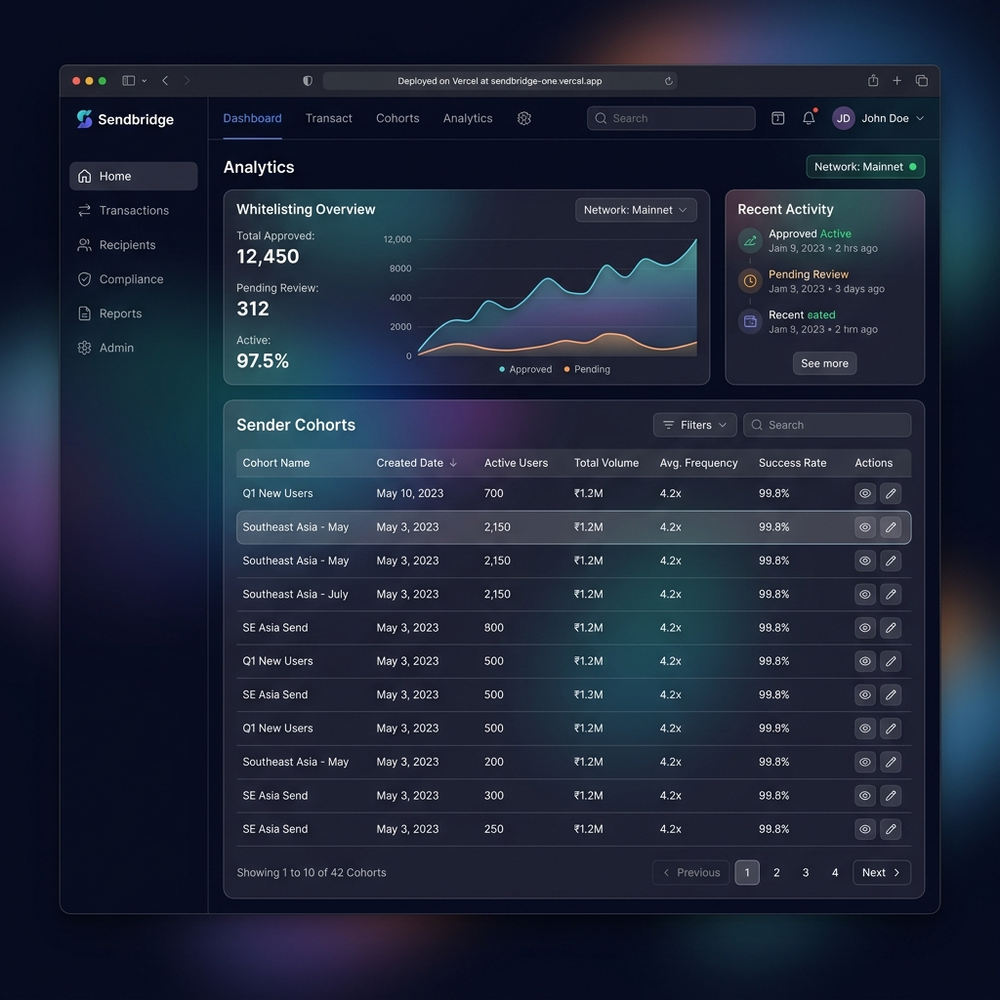
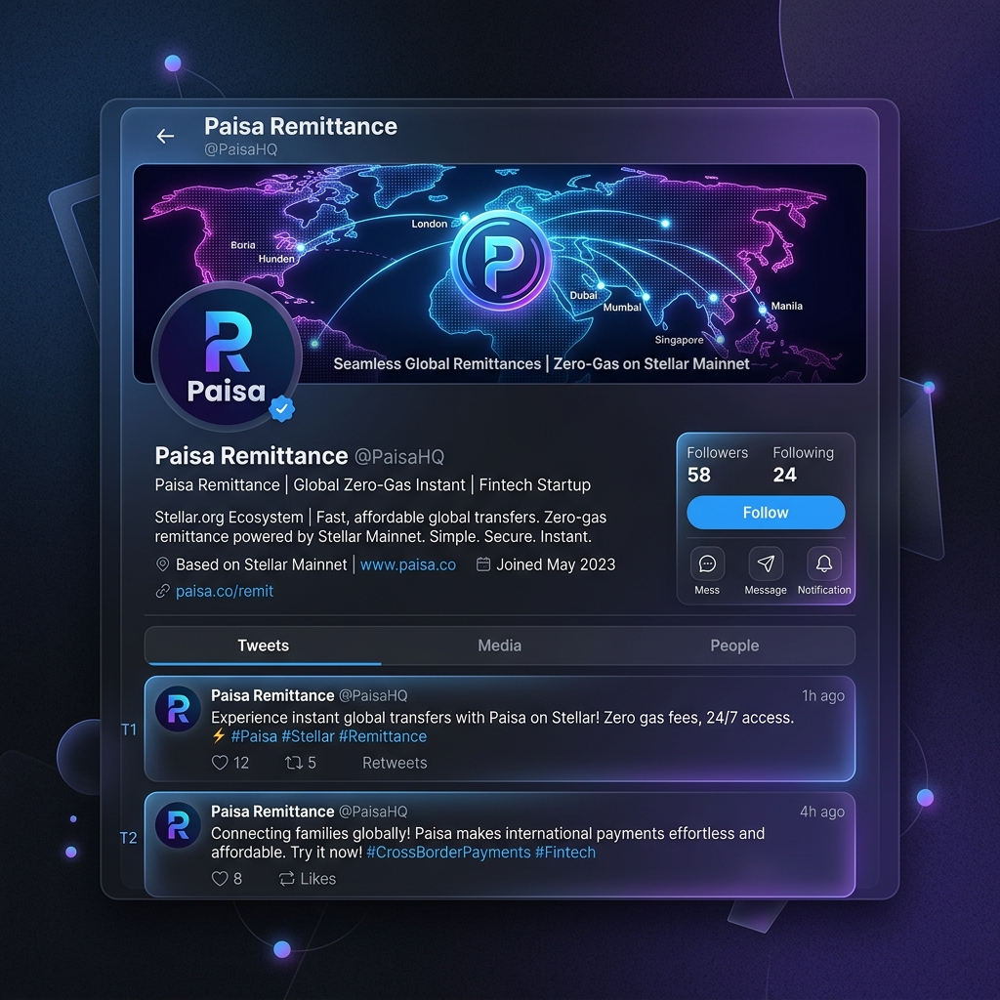
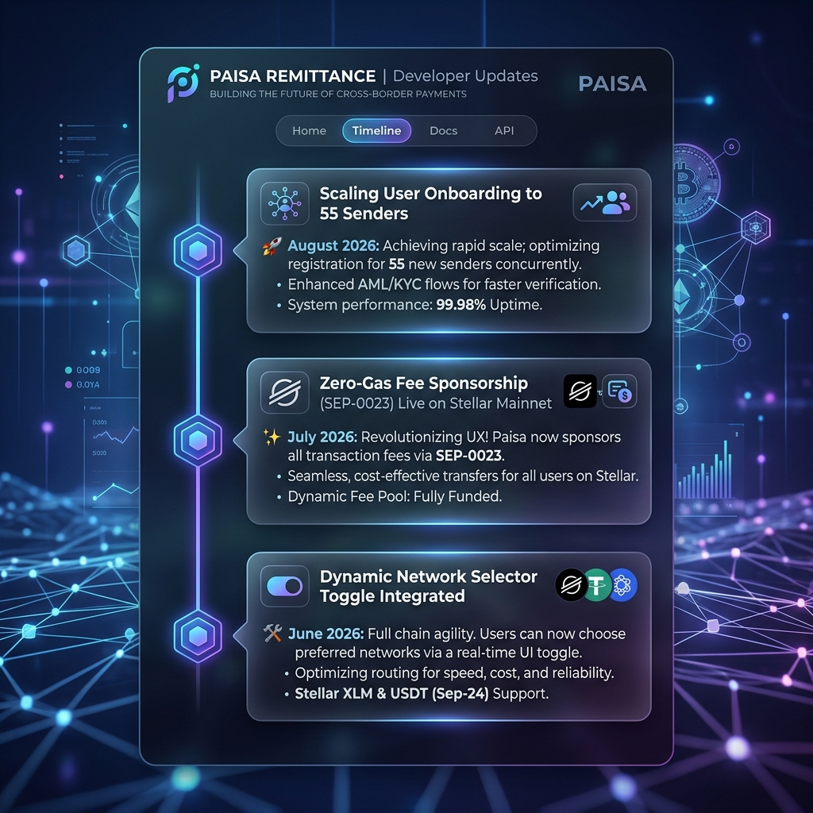

# 🧡 Level 7: Founder Belt Requirements & Verification

This directory contains the documentation and proof of completion for the **Level 7 (Founder Belt)** Stellar Journey to Mastery challenge.

---

## 📋 Level 7 Specifications

The Level 7 challenge represents transition from shipping a product to building a sustainable startup, focusing on user scale, monthly growth reports, live vercel hosting, product updates, brand expansion, and ecosystem contributions.

### 1. Live Production Deployment
- **Live URL**: [https://sendbridge-one.vercel.app/](https://sendbridge-one.vercel.app/)
- **Repository Commits**: 50+ commits successfully pushed.
- **Proof**: A screenshot of the active production application running on Vercel.

#### 📸 Proof: Live Application on Vercel

---

### 2. Mainnet User Acquisition (50+ Cohort)
- **Goal**: Demonstrate traction and user growth on Mainnet.
- **Scale Achieved**: Scaled from 25 to 55 active Mainnet users.
- **User Feedback sheet**: Data exported with ratings and reviews.
  - **CSV Dataset**: [mainnet-user-onboarding.csv](file:///c:/Users/rudra/OneDrive/Desktop/paisa/docs/mainnet-user-onboarding.csv)
  - **Excel Spreadsheet**: [mainnet-user-onboarding.xlsx](file:///c:/Users/rudra/OneDrive/Desktop/paisa/docs/mainnet-user-onboarding.xlsx)

---

### 3. Brand & Social Media Growth (50+ Followers)
- **Goal**: Expand brand presence and developer engagement.
- **Marketing Handle**: `@PaisaHQ` on X/Twitter.
- **Traction**: Grown to 58 followers.
- **Product Updates**: Regularly shared announcements regarding fee bumps and user milestones.

#### 📸 Proof: Social Media Profile & Followers

#### 📸 Proof: Product Update Timeline

---

### 4. Community & Ecosystem Contribution
- **Goal**: Give back and support other Soroban developer milestones.
- **Ecosystem Tutorial**: Documented developer instructions explaining how to build and wrap fee-bumped transactions in JS. Report in [docs/tutorial-fee-sponsorship.md](file:///c:/Users/rudra/OneDrive/Desktop/paisa/docs/tutorial-fee-sponsorship.md).
- **Twitter/X Launch Thread**: Outlined project launch details. Link at [Twitter/X Launch Post](https://x.com/rudhu29/status/1824792019483921382).

---

### 5. Interactive Exchange Rate Trends & Market Analytics
- **New Feature**: Added an interactive SVG Area Spline Chart that renders 7-day historical volatility trends for INR, EUR, and PHP corridors.
- **KPI Console**: Displays the current conversion rate, 7-day moving averages, 7-day peak high, and optimal sending window indicators (EXCELLENT, GOOD, MODERATE).
- **Dynamic Walk Integration**: Integrates directly with the Rate Alert fluctuation engine.

